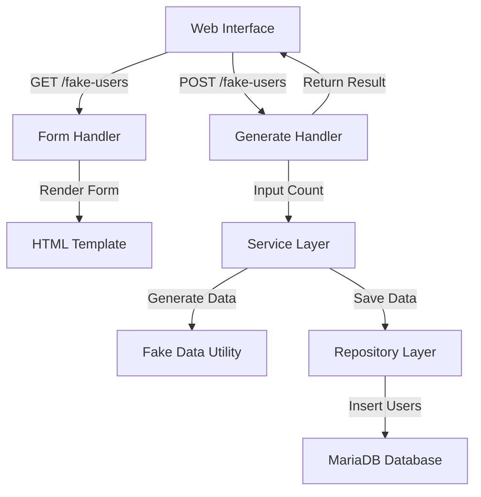

# Fake User Generation Web Interface Plan

## Overview
This document outlines the plan for implementing a web interface within a GoLang Gin framework project to generate fake user data using the `gofakeit` library and store it in a MariaDB database. The feature allows users to input a number and generate that many fake user profiles, which are then saved to the `dtxcasemgnt.user` table.

## Goal
Create a web interface that enables users to specify the number of fake users to generate and store their data in the MariaDB database.

## Steps and Components

1. **Database Integration**:
   - **Objective**: Establish connectivity to MariaDB using the database settings from [`configs/config.yaml`](configs/config.yaml).
   - **Action**: Use a Go database library like `database/sql` with the MySQL driver (`github.com/go-sql-driver/mysql`) since MariaDB is compatible with MySQL drivers. Initialize the database connection in [`internal/app/app.go`](internal/app/app.go) or a dedicated database package.
   - **Configuration**: Update [`configs/config.yaml`](configs/config.yaml) to ensure correct MariaDB connection details (host, port, user, password, database name).

2. **Model Update**:
   - **Objective**: Align the `User` model with the provided `user` table schema.
   - **Action**: Update [`internal/models/models.go`](internal/models/models.go) to include all fields from the schema (`ID`, `account`, `create_time`, `email`, `last_login_date`, `password`, `status`, `steam_id`, `tel_cell`, `username`). Add appropriate tags for JSON serialization and database mapping.
   - **Validation**: Ensure unique constraints are considered in data generation to avoid conflicts.

3. **Fake Data Generation with `gofakeit`**:
   - **Objective**: Use the `gofakeit` library to generate realistic fake user data.
   - **Action**: Add `github.com/brianvoe/gofakeit/v6` to dependencies in [`go.mod`](go.mod). Create a utility function in a new file, e.g., `internal/utils/fake_data.go`, to generate fake user data matching the `User` model fields.
   - **Logic**: Ensure generated data respects unique constraints by checking for duplicates or using unique generation methods.

4. **Repository Layer Implementation**:
   - **Objective**: Implement database operations for inserting users.
   - **Action**: Update [`internal/repository/repository.go`](internal/repository/repository.go) to include a method like `BatchCreateUsers` for inserting multiple users at once using a prepared statement or batch insert to optimize performance. Handle errors for unique constraint violations.
   - **Connection**: Inject the database connection into the `UserRepository` struct.

5. **Service Layer Implementation**:
   - **Objective**: Add business logic for generating and saving fake users.
   - **Action**: Update [`internal/service/service.go`](internal/service/service.go) to include a method like `GenerateFakeUsers(count int)` that uses the fake data utility to create user data and calls the repository to save it. Include validation to ensure the count is within reasonable limits (e.g., 1-1000).

6. **Handler and Routing for Web Interface**:
   - **Objective**: Create endpoints for displaying the web form and handling form submission.
   - **Action**: In [`internal/handlers/handlers.go`](internal/handlers/handlers.go), add handlers:
     - `GenerateFakeUsersFormHandler` to render an HTML form for inputting the number of users.
     - `GenerateFakeUsersHandler` to process the form submission, call the service to generate users, and display results or errors.
   - **Routing**: Update [`internal/app/app.go`](internal/app/app.go) in `initializeRoutes()` to map routes like `GET /fake-users` for the form and `POST /fake-users` for submission.

7. **Web Interface (HTML Template)**:
   - **Objective**: Provide a simple web interface for user interaction.
   - **Action**: Create a new directory `templates/` and add an HTML file `fake_users.html` with a form for entering the number of fake users to generate. Use Gin's HTML rendering capabilities by loading templates in [`internal/app/app.go`](internal/app/app.go).
   - **Feedback**: Display success or error messages on the same page after form submission.

8. **Error Handling and Logging**:
   - **Objective**: Ensure robust error handling and logging for the feature.
   - **Action**: Implement error handling in handlers and service methods to catch database errors and display user-friendly messages. Add logging in [`internal/app/app.go`](internal/app/app.go) or a dedicated logging middleware to track operations and errors using settings from [`configs/config.yaml`](configs/config.yaml).

9. **Testing and Validation**:
   - **Objective**: Verify the feature works as expected.
   - **Action**: Add basic unit tests for the service and repository methods in new files like `internal/service/service_test.go`. Manually test the web interface to ensure form submission works and data is correctly inserted into the database.

## Architecture Flow Diagram

## Summary of File Changes
- Update [`configs/config.yaml`](configs/config.yaml) for MariaDB settings.
- Update [`internal/models/models.go`](internal/models/models.go) for `User` struct.
- Add `internal/utils/fake_data.go` for fake data generation.
- Update [`internal/repository/repository.go`](internal/repository/repository.go) for database operations.
- Update [`internal/service/service.go`](internal/service/service.go) for business logic.
- Update [`internal/handlers/handlers.go`](internal/handlers/handlers.go) for web handlers.
- Update [`internal/app/app.go`](internal/app/app.go) for routing and template loading.
- Add `templates/fake_users.html` for the web form.

This plan ensures a complete feature implementation from database integration to user interface, adhering to Go and Gin best practices by maintaining separation of concerns across layers.